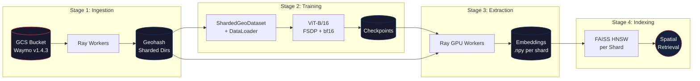
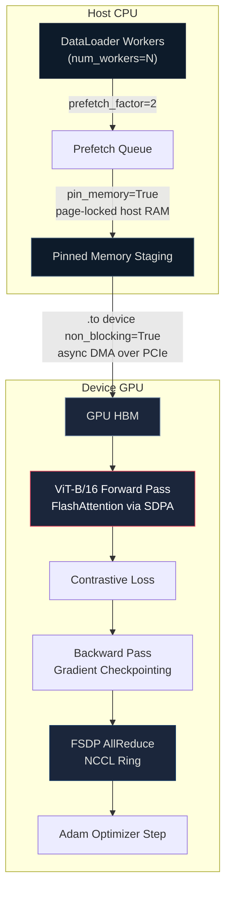
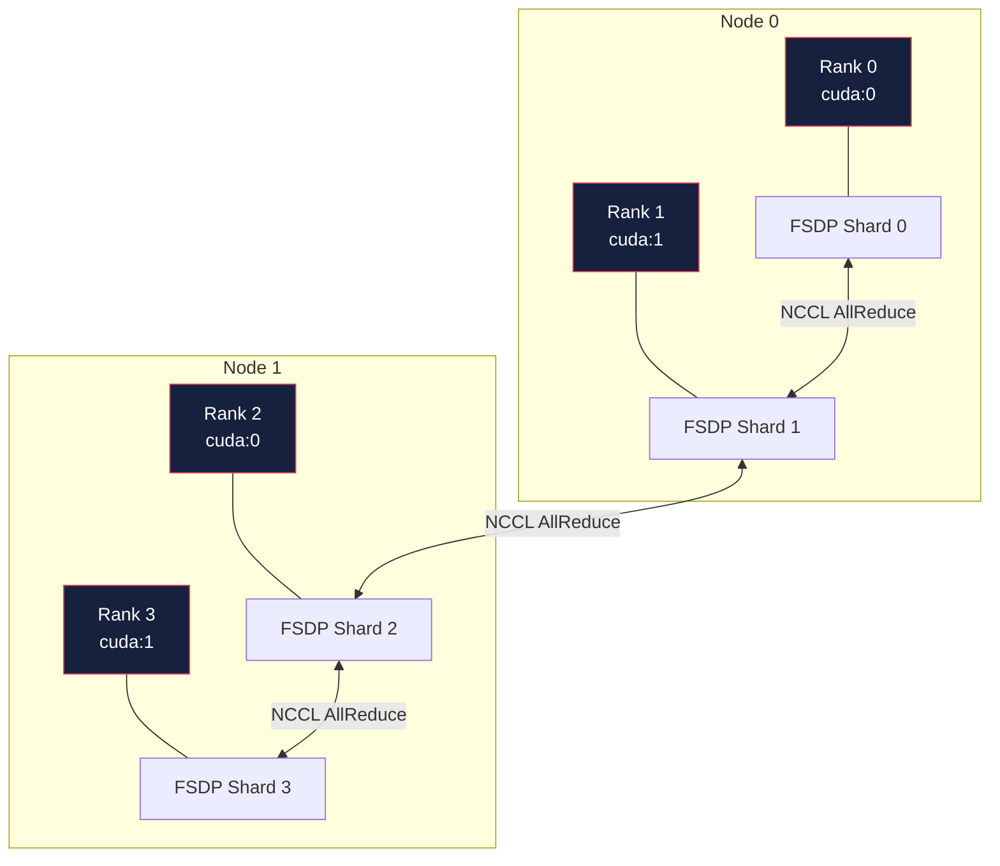
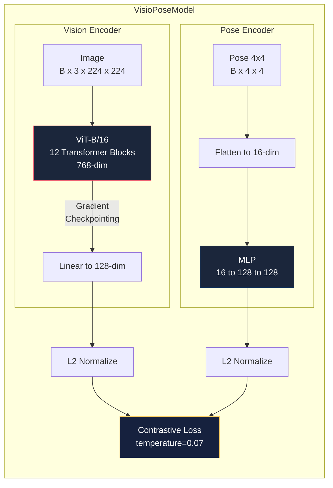

# GeoScale: Distributed Training Infrastructure for Large Geospatial Models

<p align="center">
  
  
  
  
  
</p>

GeoScale is a locally distributed training and data ingestion infrastructure that simulates the massive system architecture required to train Large Geospatial Foundation Models on millions of global posed images.

This project implements everything necessary to scale vision systems to multi-GPU environments, featuring authentic autonomous driving dataset ingestion, Vision Transformers, and efficient memory pipelining.

---

## 🚀 Features & Architecture

### High-Level Architecture

GeoScale represents a 4-stage distributed pipeline seamlessly overlapping I/O bounds with compute capacity:

1. **Distributed Data Ingestion (`ingestion/`):** Utilizes `Ray` to distribute the heavy downloading, coordinate geohashing, and metadata parsing of raw `.tfrecord` segments.
2. **Sharded Data Loading (`dataset/`):** Sharded folders split by Geohash prefixes with optimized asynchronous Multi-worker `DataLoader`s.
3. **Multi-GPU Distributed Training Engine (`training/`):** A sophisticated PyTorch engine that wraps the model in FullyShardedDataParallel (FSDP) and overlaps host-to-device memory transfers using pinned memory.
4. **Geospatial Embedding Extraction & Indexing (`extraction/` & `indexing/`):** `Ray`-orchestrated inference workers distribute model shards across GPUs to churn out latent embeddings, which are ultimately organized via a clustered `faiss` index for rapid spatial recall.



### Low-Level Implementations & Optimizations

- **Vision Transformers (ViT):** The model backend rests on a 768-dim `vit_b_16` using `scaled_dot_product_attention` (FlashAttention). Intermediate transformer encoder features are protected by PyTorch's native `checkpoint` hooks for aggressive memory scaling.
- **FSDP with Mixed Precision:** Memory footprint is halved using PyTorch's `FullyShardedDataParallel` configured with an explicit `torch.bfloat16` `MixedPrecision` policy running over the high bandwidth `nccl` backend.
- **CPU-GPU Memory Overlapping:** All batch tensors (`.to(device, non_blocking=True)`) are asynchronously copied to explicitly `pin_memory=True` designated VRAM to minimize compute starvation.
- **Authentic SLAM Data (Waymo):** Integrates directly with the `waymo_open_dataset_v_1_4_3` on Google Cloud Storage, extracting ground truth `FRONT` camera matrices (Extrinsic & Intrinsic) and GPS coordinates derived from the vehicle's SE(3) spatial pose.
- **Profiler Diagnostics:** Real-time bottlenecks are identified and tracked natively via `torch.profiler` integrated directly into the `train.py` lifecycle.

### Data Flow & Memory Pipeline



### Distributed Process Topology



---

## 🧩 Component Deep Dive

### 1. Distributed Ingestion Layer — `ingestion/pipeline.py`

| Aspect | Detail |
|---|---|
| **Orchestration** | Ray task-parallel workers (`@ray.remote`) |
| **Data Sources** | Waymo Open Dataset v1.4.3 (GCS) or synthetic generator |
| **Spatial Partitioning** | Geohash-2 encoding at configurable precision (default `prefix_length=5`) |
| **Pose Validation** | SE(3) orthogonality check (`det(R)==1`, `RᵀR == I`) before shard write |
| **Output Format** | Per-record `{id}.jpg` + `{id}.json` (image, pose 4×4, intrinsics 3×3, GPS, geohash) |

The pipeline dispatches `N` Ray workers, each responsible for a batch of records. Each worker either generates synthetic data or streams `.tfrecord` segments from the `waymo_open_dataset_v_1_4_3` GCS bucket via the `WaymoGCSAdapter`. Every record is geohash-encoded and written to a shard directory named by its geohash prefix, creating a naturally geo-partitioned filesystem layout.

```
data/dataset/
├── 9q8yy/              ← San Francisco region
│   ├── a1b2c3d4.jpg
│   └── a1b2c3d4.json     { pose: [[4x4]], intrinsics: [[3x3]], lat, lon, geohash }
├── 9q8yz/
│   └── ...
└── dp3wf/              ← Chicago region
    └── ...
```

---

### 2. Waymo GCS Adapter — `dataset/waymo.py`

| Aspect | Detail |
|---|---|
| **Source** | `gs://waymo_open_dataset_v_1_4_3` |
| **Parser** | TensorFlow `TFRecordDataset` → Waymo `Frame` protobuf |
| **Camera** | Extracts `FRONT` camera JPEG bytes |
| **Pose Math** | `GlobalCameraPose = VehiclePose₄ₓ₄ × CameraExtrinsic₄ₓ₄` |
| **Intrinsics** | Waymo 1D `[f_u, f_v, c_u, c_v, k₁…k₃]` → Standard 3×3 pinhole `K` matrix |
| **GPS** | Approximated from vehicle pose translation via geodetic scaling |

The adapter opens a `.tfrecord` file from GCS and iterates through Waymo `Frame` protobufs. For each frame, it extracts the FRONT camera's raw JPEG bytes, computes the global camera pose by multiplying the vehicle's world-frame transform with the camera extrinsic calibration, and reshapes the 1D intrinsic array into a standard 3×3 pinhole camera matrix.

---

### 3. Sharded Dataset & DataLoader — `dataset/loader.py`

| Aspect | Detail |
|---|---|
| **Dataset Class** | `ShardedGeoDataset(Dataset)` — discovers all `.jpg`/`.json` pairs recursively |
| **Transforms** | `Resize(224)` → `ToTensor()` → `Normalize(ImageNet μ/σ)` |
| **Async Prefetch** | `prefetch_factor=2` with multi-process `num_workers` |
| **Pinned Memory** | `pin_memory=True` when GPU enabled (page-locks host tensors for async DMA) |
| **Distributed Sampling** | `DistributedSampler` for multi-rank partitioning |

The dataset walks the geohash-sharded directory tree and pairs every `.jpg` with its `.json` metadata sidecar. The `DataLoader` spawns `num_workers` background processes that asynchronously read, decode, and transform image batches into pinned CPU memory. When training on GPU, `.to(device, non_blocking=True)` initiates an asynchronous DMA copy that overlaps with the previous batch's backward pass, minimizing I/O stalls.

---

### 4. Vision-Pose Contrastive Model — `training/model.py`



| Aspect | Detail |
|---|---|
| **Vision Backbone** | `vit_b_16` (86M params, 768-dim, 12 encoder blocks) |
| **Attention** | PyTorch 2.0+ `scaled_dot_product_attention` (FlashAttention kernel on CUDA bf16) |
| **Checkpointing** | Per-block `torch.utils.checkpoint` wrapping to trade compute for memory |
| **Pose Encoder** | 2-layer MLP `(16 → 128 → 128)` operating on flattened SE(3) matrices |
| **Loss** | Symmetric InfoNCE contrastive loss aligning vision and pose embeddings |
| **Embedding Dim** | 128-d L2-normalized vectors |

---

### 5. Distributed Training Engine — `training/train.py`

| Aspect | CPU Mode | GPU Mode |
|---|---|---|
| **Backend** | `gloo` | `nccl` |
| **Parallelism** | `DistributedDataParallel` | `FullyShardedDataParallel` |
| **Precision** | `float32` | `bfloat16` (MixedPrecision policy) |
| **Data Transfer** | `.to('cpu')` | `.to('cuda:N', non_blocking=True)` |
| **Profiler** | CPU activity tracing | CPU + CUDA kernel tracing |

On launch, the script reads `RANK`, `WORLD_SIZE`, and `LOCAL_RANK` from `torchrun` environment variables. If CUDA is available and `--use-gpu` is set, it initializes NCCL and wraps the model in `FSDP` with a `bfloat16` `MixedPrecision` policy that shards parameters, gradients, and optimizer states across all ranks. Otherwise it falls back gracefully to Gloo + DDP. The training loop logs per-batch throughput, checkpoints after every epoch, and optionally emits TensorBoard-compatible profiler traces.

---

### 6. Embedding Extraction Service — `extraction/worker.py`

| Aspect | Detail |
|---|---|
| **Orchestration** | Ray actor pool (`EmbeddingWorker` × `num_workers`) |
| **GPU Scheduling** | `ray.remote(num_gpus=1)` per worker when GPU enabled |
| **Inference** | `torch.no_grad()` forward through vision encoder |
| **Output** | `embeddings.npy` (float32, shape `[N, 128]`) + `embedding_ids.txt` per shard |
| **Load Balancing** | Round-robin shard assignment across worker pool |

Each `EmbeddingWorker` is a stateful Ray actor that loads the trained checkpoint and holds the model in GPU (or CPU) memory. Shards are assigned round-robin to workers. Each worker iterates over its assigned shard's images, runs a `no_grad` forward pass to extract the 128-dim vision embedding, and writes the result as a dense NumPy array alongside an ID manifest.

---

### 7. Spatial Index & Retrieval — `indexing/faiss_builder.py`

| Aspect | Detail |
|---|---|
| **Index Type** | `faiss.IndexHNSWFlat` (graph-based ANN) |
| **Graph Params** | `M=32` neighbors, `efConstruction=64`, `efSearch=64` |
| **Scope** | One HNSW index per geohash shard |
| **Evaluation** | `Recall@10` + per-query latency (ms) benchmark |
| **Persistence** | `faiss.write_index` / `faiss.read_index` per shard |

For each shard directory containing an `embeddings.npy`, the builder constructs an HNSW graph index over the 128-dim vectors. The geo-partitioned index structure means queries are naturally scoped to a spatial region (defined by the geohash prefix), enabling efficient geo-bounded retrieval without scanning the entire corpus. After building, each shard index is self-benchmarked for recall and latency.

---

## 📊 Training Data & Benchmark Results

### Data Sources

| Source | Type | Records | Imagery | Pose | Intrinsics |
|---|---|---|---|---|---|
| **Waymo Perception v1.4.3** | Autonomous driving | 103K+ segments | 5 cameras, 1920×1280 | LiDAR-SLAM 4×4 | Calibrated 3×3 |
| **Synthetic Generator** | Random noise | Configurable | 224×224 RGB noise | Random SE(3) | Fixed pinhole |

### Local Benchmark (Apple Silicon, CPU, Synthetic Data)

| Stage | Metric | Value |
|---|---|---|
| **Ingestion** | Throughput | **230+ records/sec** (2 Ray workers) |
| **Training** | ViT-B/16 forward+backward | **~8.5 imgs/sec** (single CPU process) |
| **Extraction** | Embedding throughput | **~15 embeds/sec** (2 Ray workers) |
| **Indexing** | HNSW build + benchmark | **Recall@10 = 1.00**, **< 0.1 ms/query** |

---

## 📦 Getting Started

### Prerequisites

GeoScale requires Python 3.9+ and is designed for CUDA or Mac M-Series architectures.

```bash
python3 -m venv venv && source venv/bin/activate
pip install -r requirements.txt
```

### Configuration

All hyperparameters are located in `configs/default.yaml`:
- **`use_gpu`**: Set to `auto`, `true`, or `false` (seamless DDP fallback on CPU).
- **`data_source`**: Determines the ingestion target (`waymo` or `synthetic`).

### Running the Pipeline

```bash
# 1. Ingest data (synthetic or Waymo)
python -m ingestion.pipeline --total 1000 --batch 250 --output data/dataset

# 2. Train model
python -m training.train --data-dir data/dataset --epochs 3 --batch-size 32

# 3. Extract embeddings
python -m extraction.worker --data-dir data/dataset --checkpoint checkpoints/latest.pt

# 4. Build spatial index
python -m indexing.faiss_builder --data-dir data/dataset
```

### Multi-GPU Training (via torchrun)

```bash
torchrun --nproc_per_node=4 -m training.train \
    --data-dir data/dataset \
    --epochs 10 \
    --batch-size 64 \
    --use-gpu \
    --checkpoint-vision
```

---

## 🗂️ Project Structure

```
GeoScale/
├── configs/
│   └── default.yaml          # System configuration
├── dataset/
│   ├── loader.py             # ShardedGeoDataset + DataLoader
│   ├── synthetic.py          # Synthetic data generators
│   └── waymo.py              # Waymo GCS adapter
├── ingestion/
│   └── pipeline.py           # Ray distributed ingestion
├── training/
│   ├── model.py              # VisioPoseModel (ViT + PoseMLP)
│   └── train.py              # FSDP/DDP training engine
├── extraction/
│   └── worker.py             # Ray embedding extraction
├── indexing/
│   └── faiss_builder.py      # HNSW index builder + recall eval
├── utils/
│   └── config.py             # YAML config loader
├── requirements.txt
└── README.md
```

---

## 🔧 Configuration Reference

```yaml
# configs/default.yaml
use_gpu: auto                                  # auto | true | false
data_source: "synthetic"                       # "synthetic" | "waymo"
waymo_gcs_bucket: "waymo_open_dataset_v_1_4_3" # GCS bucket name
batch_size: 32
num_workers: 4
world_size: 4
shard_prefix_length: 5                         # Geohash prefix for sharding
```

| Parameter | Description |
|---|---|
| `use_gpu` | `auto` detects CUDA and enables GPU paths; `false` forces CPU/Gloo |
| `data_source` | Switches ingestion between synthetic mock data and real Waymo GCS streaming |
| `shard_prefix_length` | Controls geohash granularity (3 ≈ 156km, 5 ≈ 4.9km, 7 ≈ 153m) |
