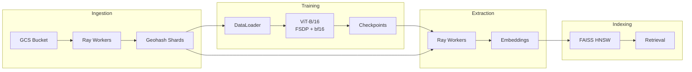
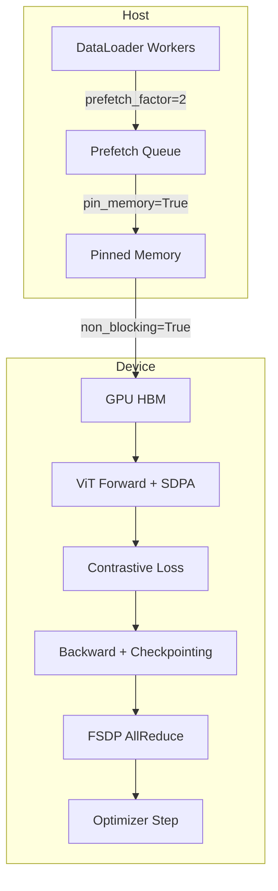
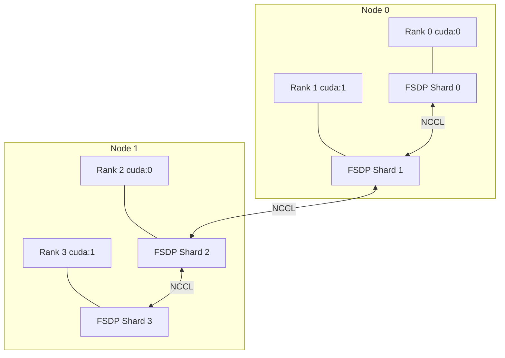
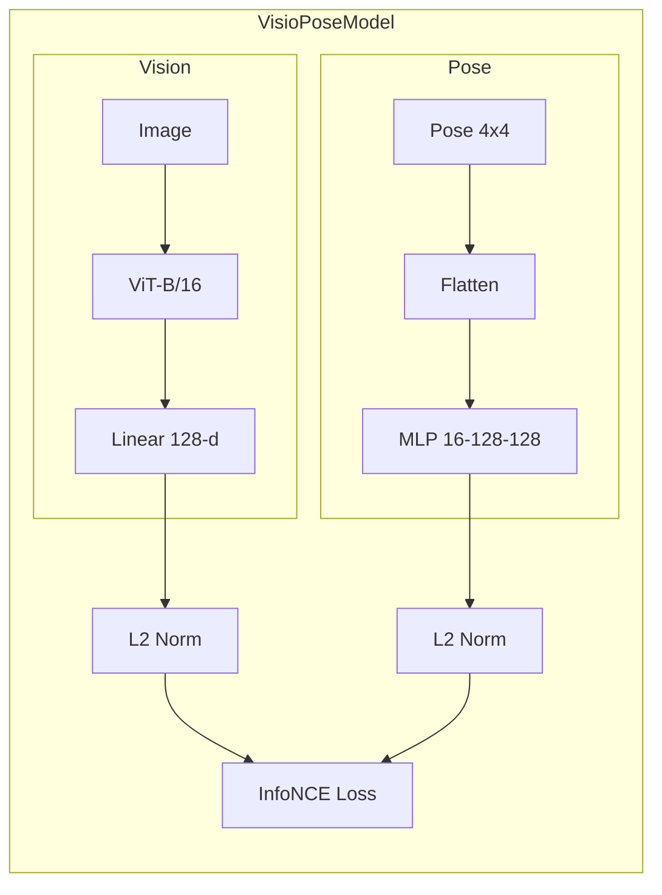

# GeoScale

**Distributed training infrastructure for large-scale geospatial vision models.**

<p align="center">
  
  
  
  
</p>

GeoScale implements the full training lifecycle for geospatial foundation models: parallel data ingestion from cloud object stores, geohash-sharded dataset construction, multi-GPU distributed training with Vision Transformers, embedding extraction, and approximate nearest neighbor retrieval.

The system is designed around four decoupled pipeline stages that scale independently and overlap I/O with compute.

---

## Architecture

### Pipeline Overview



**Stage 1 — Ingestion.** Ray workers download and parse `.tfrecord` segments from the Waymo Open Dataset (or generate synthetic data), validate SE(3) poses, encode GPS coordinates into geohashes, and write image/metadata pairs to shard directories.

**Stage 2 — Training.** A `DataLoader` with async prefetching and pinned memory feeds a ViT-B/16 backbone wrapped in FSDP with bf16 mixed precision. The contrastive objective aligns vision embeddings with pose embeddings in a shared 128-d space.

**Stage 3 — Extraction.** Stateful Ray actors load the trained checkpoint and run `no_grad` inference across shards, writing dense embedding arrays per shard.

**Stage 4 — Indexing.** Per-shard HNSW indices enable geo-bounded approximate nearest neighbor search with sub-millisecond query latency.

### Memory Pipeline



Data transfer from host to device uses pinned memory with `non_blocking=True` to overlap PCIe copies with compute on the previous batch. Gradient checkpointing on the ViT encoder blocks trades recomputation for memory, enabling larger effective batch sizes.

### FSDP Topology



When CUDA is available, the model is wrapped in `FullyShardedDataParallel` with a bf16 `MixedPrecision` policy over NCCL. On CPU-only systems, it falls back to standard `DistributedDataParallel` over Gloo.

---

## Components

### Ingestion — `ingestion/pipeline.py`

| | |
|---|---|
| **Orchestration** | Ray task-parallel workers (`@ray.remote`) |
| **Data sources** | Waymo Perception v1.4.3 via GCS, or synthetic generator |
| **Partitioning** | Geohash encoding at configurable prefix length |
| **Validation** | SE(3) orthogonality and determinant checks on pose matrices |
| **Output** | `{id}.jpg` + `{id}.json` per record, organized into shard directories |

```
data/dataset/
├── 9q8yy/                 # San Francisco
│   ├── a1b2c3d4.jpg
│   └── a1b2c3d4.json     # pose 4x4, intrinsics 3x3, lat, lon, geohash
├── dp3wf/                 # Chicago
│   └── ...
```

### Waymo Adapter — `dataset/waymo.py`

| | |
|---|---|
| **Source** | `gs://waymo_open_dataset_v_1_4_3` |
| **Parser** | TensorFlow `TFRecordDataset` into Waymo `Frame` protobufs |
| **Pose computation** | `CameraPose = VehiclePose × CameraExtrinsic` (both 4x4) |
| **Intrinsics** | 1D calibration array reshaped to 3x3 pinhole matrix |
| **GPS** | Derived from vehicle pose translation via geodetic approximation |

### Dataset — `dataset/loader.py`

| | |
|---|---|
| **Class** | `ShardedGeoDataset` — recursive `.jpg`/`.json` pair discovery |
| **Transforms** | Resize 224, normalize to ImageNet statistics |
| **Prefetching** | `prefetch_factor=2`, multi-process workers |
| **GPU path** | `pin_memory=True`, `non_blocking` transfers |

### Model — `training/model.py`



| | |
|---|---|
| **Vision backbone** | `vit_b_16`, 86M parameters, 768-dim encoder |
| **Attention** | `scaled_dot_product_attention` (FlashAttention on CUDA with bf16) |
| **Checkpointing** | Per-block activation checkpointing via `torch.utils.checkpoint` |
| **Pose encoder** | MLP mapping flattened 4x4 SE(3) matrices to 128-d embeddings |
| **Objective** | Symmetric InfoNCE with temperature 0.07 |

### Training — `training/train.py`

| | CPU | GPU |
|---|---|---|
| **Backend** | Gloo | NCCL |
| **Wrapper** | DDP | FSDP |
| **Precision** | float32 | bfloat16 |
| **Transfers** | Synchronous | `non_blocking=True` |
| **Profiler** | CPU tracing | CPU + CUDA tracing |

### Extraction — `extraction/worker.py`

| | |
|---|---|
| **Workers** | Ray actor pool with round-robin shard assignment |
| **GPU scheduling** | `ray.remote(num_gpus=1)` when available |
| **Output** | `embeddings.npy` (N x 128 float32) + `embedding_ids.txt` per shard |

### Indexing — `indexing/faiss_builder.py`

| | |
|---|---|
| **Index** | `faiss.IndexHNSWFlat`, M=32, efConstruction=64 |
| **Scope** | One index per geohash shard |
| **Evaluation** | Recall@10 and per-query latency benchmarks |

---

## Benchmarks

Measured on Apple Silicon (CPU, synthetic data):

| Stage | Metric | Result |
|---|---|---|
| Ingestion | Throughput | 230+ records/sec (2 workers) |
| Training | ViT-B/16 forward+backward | ~8.5 imgs/sec |
| Extraction | Embedding throughput | ~15 embeds/sec (2 workers) |
| Indexing | HNSW recall and latency | Recall@10 = 1.00, < 0.1 ms/query |

### Data Sources

| Source | Records | Imagery | Pose | Intrinsics |
|---|---|---|---|---|
| Waymo Perception v1.4.3 | 103K+ segments | 5 cameras, 1920x1280 | LiDAR-SLAM 4x4 | Calibrated 3x3 |
| Synthetic generator | Configurable | 224x224 random | Random SE(3) | Fixed pinhole |

---

## Getting Started

```bash
python3 -m venv venv && source venv/bin/activate
pip install -r requirements.txt
```

Edit `configs/default.yaml` to set `data_source` (`synthetic` or `waymo`) and `use_gpu` (`auto`, `true`, `false`).

```bash
# Ingest
python -m ingestion.pipeline --total 1000 --batch 250 --output data/dataset

# Train
python -m training.train --data-dir data/dataset --epochs 3 --batch-size 32

# Extract embeddings
python -m extraction.worker --data-dir data/dataset --checkpoint checkpoints/latest.pt

# Build index
python -m indexing.faiss_builder --data-dir data/dataset
```

Multi-GPU training via torchrun:

```bash
torchrun --nproc_per_node=4 -m training.train \
    --data-dir data/dataset \
    --epochs 10 \
    --batch-size 64 \
    --use-gpu \
    --checkpoint-vision
```

---

## Project Structure

```
GeoScale/
├── configs/
│   └── default.yaml
├── dataset/
│   ├── loader.py             # ShardedGeoDataset + DataLoader
│   ├── synthetic.py          # Synthetic data generators
│   └── waymo.py              # Waymo GCS adapter
├── ingestion/
│   └── pipeline.py           # Ray distributed ingestion
├── training/
│   ├── model.py              # VisioPoseModel (ViT-B/16 + Pose MLP)
│   └── train.py              # FSDP/DDP training loop
├── extraction/
│   └── worker.py             # Ray embedding extraction
├── indexing/
│   └── faiss_builder.py      # HNSW index builder
├── utils/
│   └── config.py             # YAML config loader
└── requirements.txt
```

## Configuration

```yaml
use_gpu: auto                                  # auto | true | false
data_source: "synthetic"                       # synthetic | waymo
waymo_gcs_bucket: "waymo_open_dataset_v_1_4_3"
batch_size: 32
num_workers: 4
world_size: 4
shard_prefix_length: 5
```

| Parameter | Description |
|---|---|
| `use_gpu` | Detects CUDA when set to `auto`; forces CPU with `false` |
| `data_source` | Switches between synthetic mock data and Waymo GCS streaming |
| `shard_prefix_length` | Geohash granularity: 3 ~ 156km, 5 ~ 4.9km, 7 ~ 153m |
